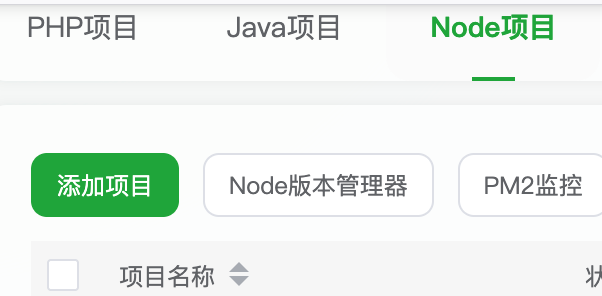
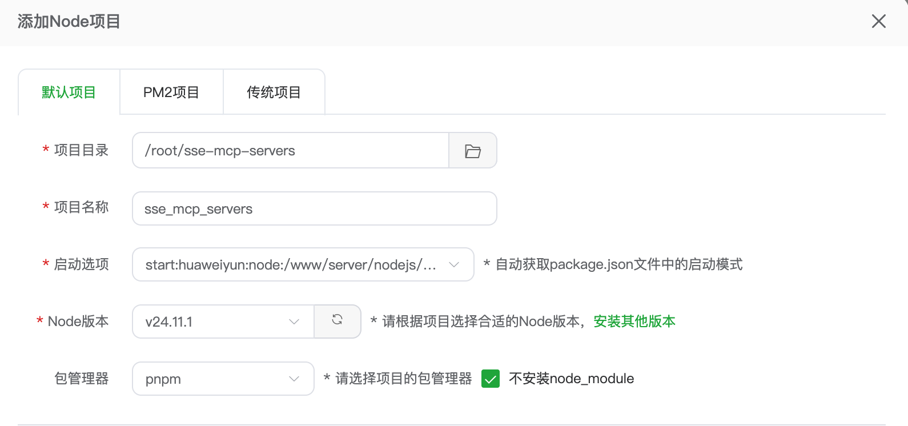

# SSE MCP Servers

## MCP 服务配置

```json
{
  "mcpServers": {
    "addNumMCP": {
      "url": "http://xxx.xxx.xxx.xxx:4000/sse",
      "type": "sse",
      "transportType": "sse"
    }
  }
}
```

## 部署（宝塔面板）

### Node 版本

1. 查找 node 和项目的绝对路径
2. 修改 start:huaweiyun:node 命令
3. 添加 Node 项目
   
4. 配置 Node 项目
   
5. 配置端口放行

### Python 版本
